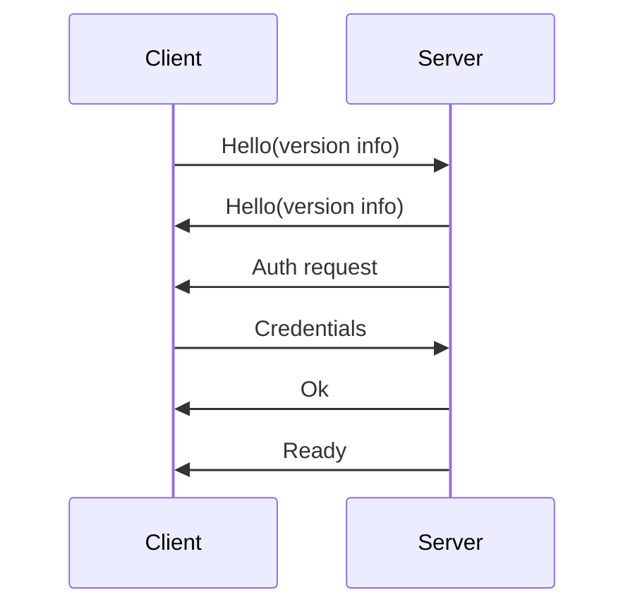

```mermaid
sequenceDiagram
    participant C as Client
    participant S as Server

    C->>S: Hello(version info)
    S->>C: Hello(version info)
    S->>C: Auth request
    C->>S: Credentials
    S->>C: Ok
    S->>C: Ready
```
