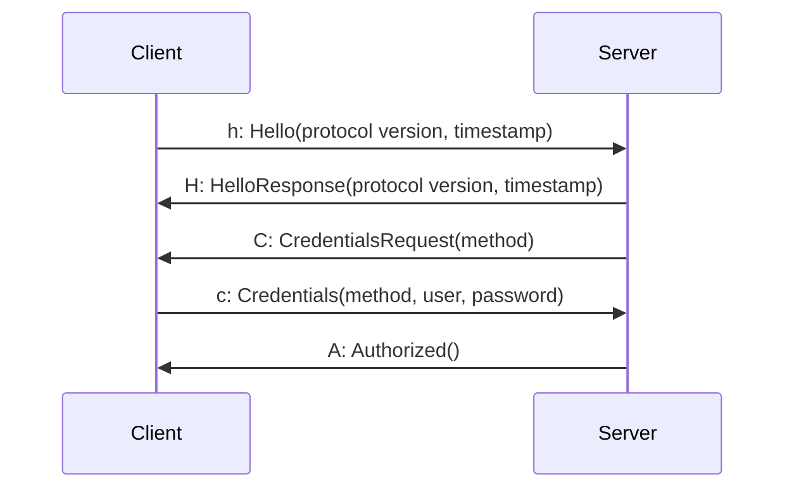

Процесс установки соединения начинается с отправки клиентом комманды `Hello`.  Сервер проверяет поддерживается ли
запрашиваемая версия протокола и в случае успеха отправляет `HelloResponse`. После этого сервер запрашивает данные для
авторизации `CredentialsRequest`.

Если в процессе установки соединения происходит ошибка сервер посылает сообщение `ErrorMessage` и закрывает соединение.