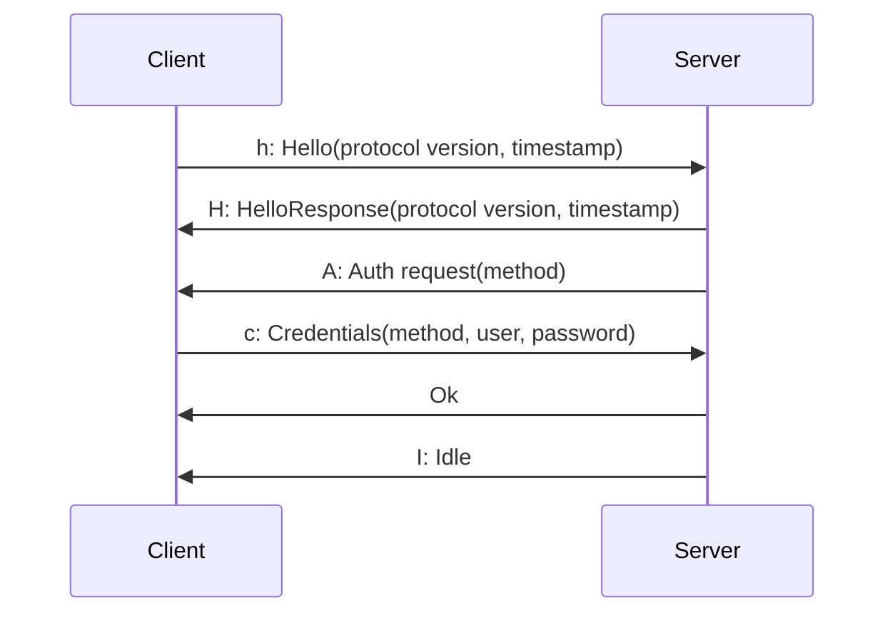

```mermaid
sequenceDiagram
    participant C as Client
    participant S as Server

    C->>S: h: Hello(protocol version, timestamp)
    S->>C: H: HelloResponse(protocol version, timestamp)
    S->>C: A: Auth request(method)
    C->>S: c: Credentials(method, user, password)
    S->>C: Ok
    S->>C: I: Idle
```
