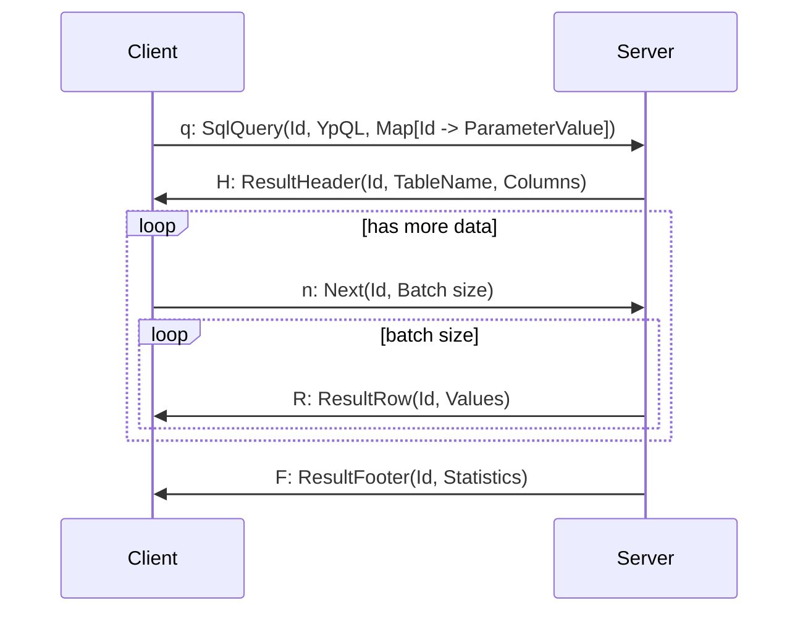

После успешной [авторизации](connect.md) сервер готов к получению [YupanaQL](../yupanaql.md) запросов.

Клиент отправляет запрос `SqlQuery` с идетнификатором, телом запроса и параметрами.  Идентификаторы запроса должны
быть уникальными в рамках одного соединения. Если запрос обработан успешно сервер отправляет `ResultHeader` с информацией
о данных. Клиент шлет команду `Next` с желаемым колличеством строк. Сервер отправляет строки в виде `ResultRow`. Если
данных больше нет отправляется `ResultFooter`.

Клиент может досрочно завершить выполнение запроса отправив команду `Cancel`.