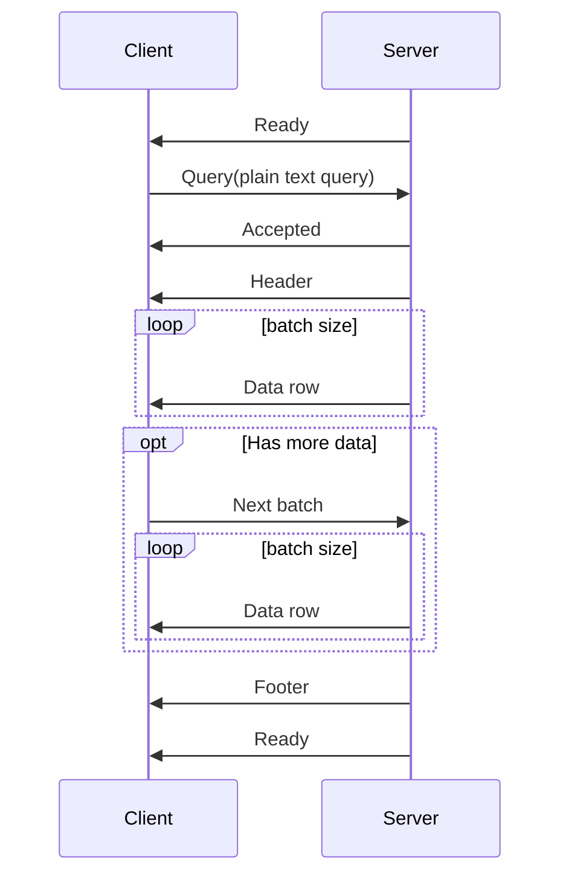

```mermaid
sequenceDiagram
    participant C as Client
    participant S as Server

    S->>C: Ready
    C->>S: Query(plain text query)
    S->>C: Accepted
    S->>C: Header
    loop batch size
        S->>C: Data row
    end
    opt Has more data
        C->>S: Next batch
        loop batch size
            S->>C: Data row
        end
    end
    S->>C: Footer
    S->>C: Ready
```
